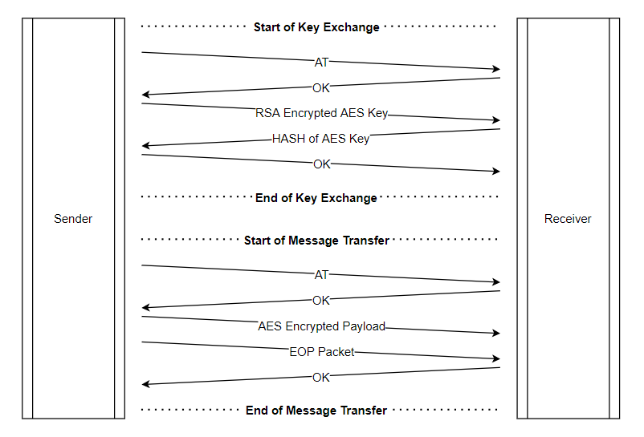
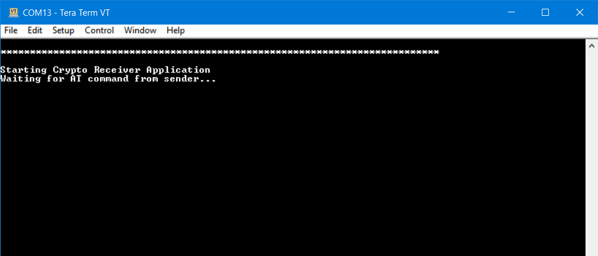
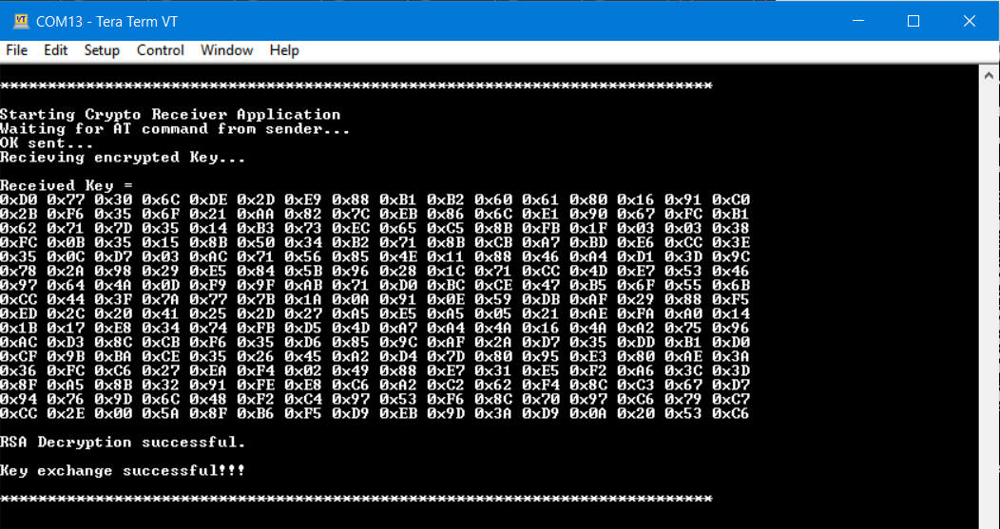
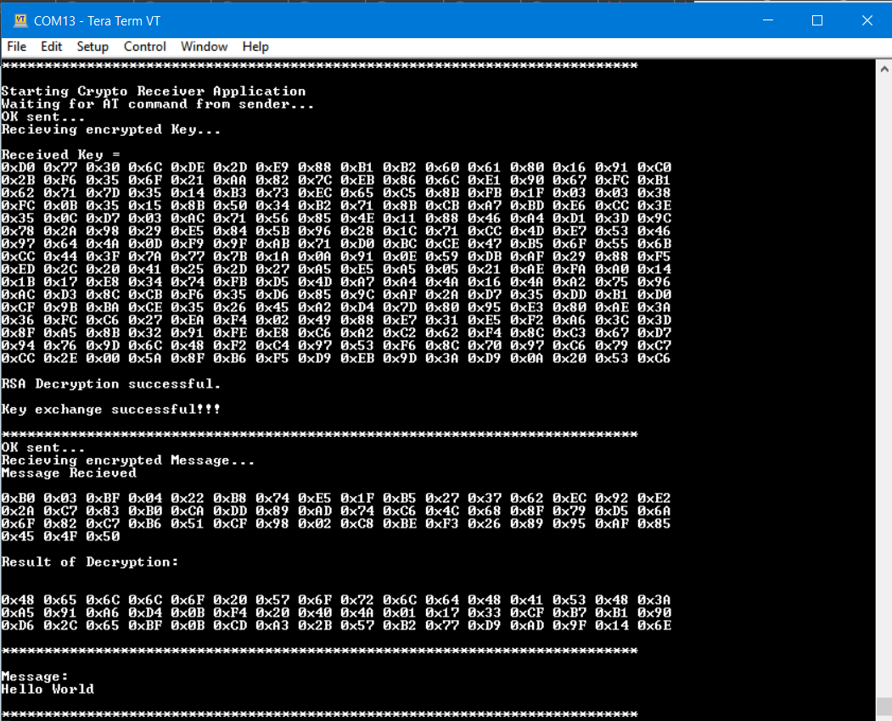
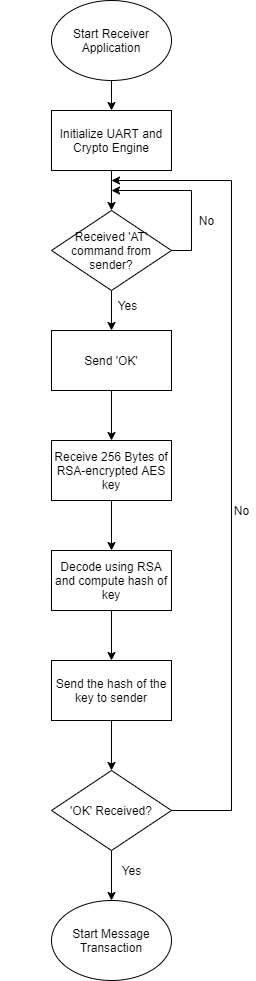
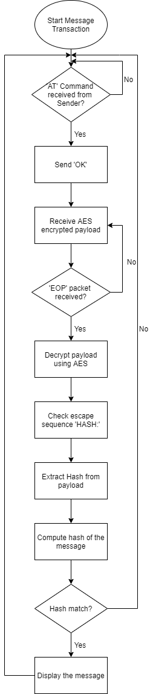

# PSoC 6 MCU: Crypto Receiver

This example demonstrates the usage of Crypto block of PSoC 6 for a secure asynchronous communication using UART. This example has two applications

1. **Crypto Sender:** This application generates a random number for AES key, encrypts it using RSA with the public key of the receiver and transmits the encrypted key to receiver. Upon successful reception, the hash of the key is received from the receiver and compared to check if the key exchange was successful. On successful key exchange, the message appended with the hash is encrypted using AES and sent to the receiver. 

2. **Crypto Receiver:** This application receives the RSA encrypted AES key from the sender and decrypts it using the public key. The hash of the key is computed and sent to the sender to validate the key exchange. Once key exchange is successful, the payload is received and decoded using AES. The hash of the message is unpacked from the received payload and computed locally. These are compared to check integrity of the message and if they are same, the message is displayed to the user. 

You can find the theory and reason for this code example in this blog post [Experimenting with PSoC 6 Crypto block](https://community.cypress.com/community/topics/cypress-community-blogs/modustoolbox-blog/blog/2020/12/14/experimenting-with-psoc-6-crypto-block).

Figure 1 provides an overview of the communication between the sender and the receiver.

 **Figure 1. Communication Overview**

 

## Requirements

- [ModusToolbox® software](https://www.cypress.com/products/modustoolbox-software-environment) v2.2  
- Board Support Package (BSP) minimum required version: 2.0.0  
- Programming Language: C  
- Associated Parts: [PSoC® 6 MCU](http://www.cypress.com/PSoC6)

## Supported Kits (make variable 'TARGET')

- [PSoC 6 Wi-Fi BT Prototyping Kit](https://www.cypress.com/CY8CPROTO-062-4343W) (CY8CPROTO-062-4343W) - Default value of `TARGET`

## Hardware Setup

This example uses the board's default configuration. See the kit user guide to ensure that the board is configured correctly.

This code example requires two kits. One kit is used as the sender and the other is used as receiver. 

Use jumper wires to establish a connection between the sender and receiver. By default, Pin 12[0] and 12[1] are used as Rx and Tx pins for UART communication between the two boards. 

Connect P12[0] of sender to P12[1] of receiver

Connect P12[1] of sender to P12[0] of receiver

## Software Setup

Install a terminal emulator if you don't have one. Instructions in this document use [Tera Term](https://ttssh2.osdn.jp/index.html.en).

## Using the Example Project

1. Download and unzip this repository onto your local machine, or clone the repository.

2. Open a CLI terminal and navigate to the application folder.

   On Linux and macOS, you can use any terminal application. On Windows, open the **modus-shell** app from the Start menu.

   **Note:** The cloned application contains a default BSP file (*TARGET_xxx.mtb*) in the *deps* folder. Use the [Library Manager](https://www.cypress.com/ModusToolboxLibraryManager) (`make modlibs` command) to select and download a different BSP file, if required. If the selected kit does not have the required resources or is not [supported](#supported-kits-make-variable-target), the application may not work. 

3. Import the required libraries by executing the `make getlibs` command.

Various CLI tools include a `-h` option that prints help information to the terminal screen about that tool. For more details, see the [ModusToolbox User Guide](https://www.cypress.com/ModusToolboxUserGuide) (locally available at *{ModusToolbox install directory}/docs_{version}/mtb_user_guide.pdf*).

4. Export the application to a supported IDE using the `make <ide>` command. 

    For a list of supported IDEs and more details, see the "Exporting to IDEs" section of the [ModusToolbox User Guide](https://www.cypress.com/ModusToolboxUserGuide) (locally available at *{ModusToolbox install directory}/docs_{version}/mtb_user_guide.pdf*.

## Operation

1. Connect the Tx and Rx pins of the sender and receiver using the instructions in the [Hardware Setup](#hardware-setup) section.

2. Connect the receiver kit to your PC using the provided USB cable through the KitProg3 USB connector.

3. Program the board with the Crypto Receiver code.

   - **Using Eclipse IDE for ModusToolbox:**

      1. Select the application project in the Project Explorer.

      2. In the **Quick Panel**, scroll down, and click **\<Application Name> Program (KitProg3_MiniProg4)**.

   - **Using CLI:**

     From the terminal, execute the `make program` command to build and program the application using the default toolchain to the default target. You can specify a target and toolchain manually:
      ```
      make program TARGET=<BSP> TOOLCHAIN=<toolchain>
      ```

      Example:
      ```
      make program TARGET=CY8CPROTO-062-4343W TOOLCHAIN=GCC_ARM
      ```

4. Connect and program the sender kit - see example project [Crypto Sender](../mtb-example-psoc6-crypto-sender/Readme.md).

5. Once the receiver program starts, the terminal emulator program will display the application as shown in Figure 2. 

**Figure 2. Start of Receiver Application**



6. Powering the sender application will initiate the key exchange code and the status will be displayed on the terminal emulator. See Figure 3. 

**Figure 3. Key Exchange Successful for Receiver**



7. When the message is sent by the sender application, the receiver receives it, decodes the message and compares the hash to check the integrity of the message. Once verified, the message will be displayed to the user. 

**Figure 4. Successful message reception**



## Debugging

You can debug the example to step through the code. In the IDE, use the **\<Application Name> Debug (KitProg3_MiniProg4)** configuration in the **Quick Panel**. For more details, see the "Program and Debug" section in the [Eclipse IDE for ModusToolbox User Guide](https://www.cypress.com/MTBEclipseIDEUserGuide).

## Design and Implementation

The following flow charts demonstrate the operation of the receiver example. The application starts with the key exchange. Refer [RSA_Readme.md](RSA/RSA_Readme.md) to know how to generate RSA Key pair.

**Figure 5. Flow Chart for Key Exchange**

 

 Once the key exchange is successful, both the sender and the receiver applications move to message transaction. The flow chart for the receiver side is shown below in Figure 6. 

 **Figure 6. Flow Chart for Message Transaction**

 
