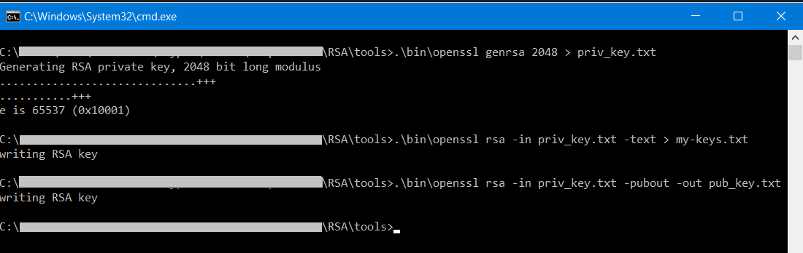
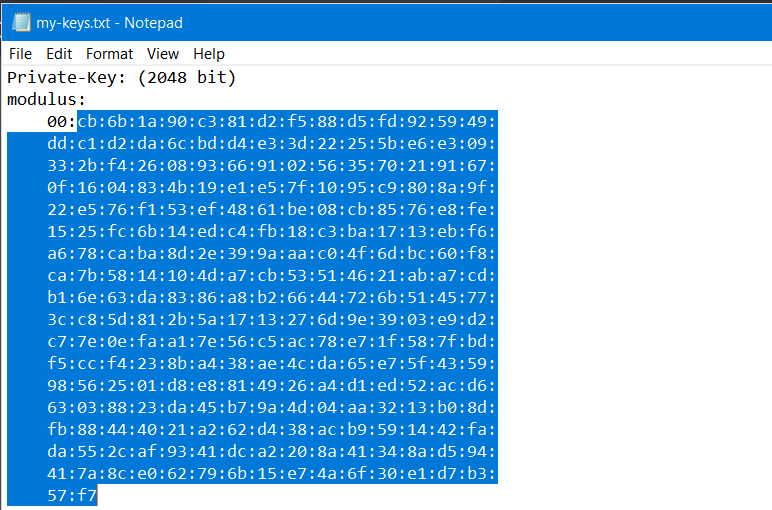
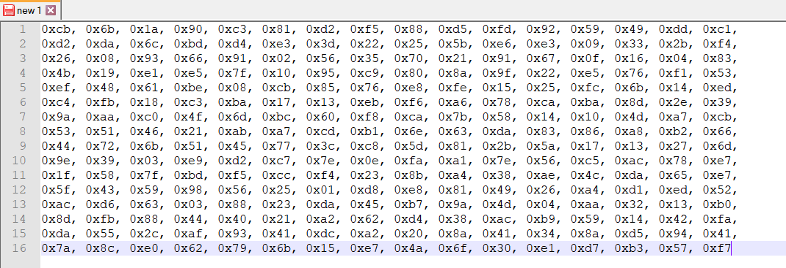

# Generating RSA Key Structures

**Note: All keys generated by openSSL tool are Big-Endian. Before using the value, these must be converted to Little-Endian by using Cy_Crypto_Rsa_InvertEndianness() API. The example project shows this implementation.**

To generate the public and private key pair, use the pre-compiled [openssl tool](https://www.openssl.org/) present in **tools** directory. 

1. Go to **tools** directory and open a command line window.

2. Generate and save the **private key** to priv_key.txt by running the command 
```
.\bin\openssl genrsa 2048 > priv_key.txt
```

3. Save the keys data to my-keys.txt file by running
```
.\bin\openssl rsa -in priv_key.txt -text > my-keys.txt
```
This generates the private key and the private key exponent. 

4. Generate the **public key** and save the key to pub_key.txt by running
```
.\bin\openssl rsa -in priv_key.txt -pubout -out pub_key.txt
```

**Figure 1. Key generation**



5. Copy the modulus data from my-keys.txt without the leading byte to any text editor and make it a hex byte array. 

**Figure 2. Data to copy**



**Figure 3. Hex Byte Array**



6. Similarly, copy the whole private exponent and prepare a hex byte array. Copy the modulus data to to the modulus array and private exponent data to the privateExponent array in `rsa.h` file in the **Receiver application**.

7. To convert the public key into a C file use the rsa_to_c.py script that is shared in the Scripts folder. Note that Python3 is required to run the script. You can download Python 3 from the [Official Python website](https://www.python.org/downloads/). 
Use the following command to run the script - 
```
python rsa_to_c.py "<path_to_rsa_public_key>\pub_key.txt" > "<path_to_output>\rsa_to_c.txt"
```
8. The necessary C structures will be generated in the rsa_to_c.txt file. Replace the following in rsa.h of the **Sender application** with the data in rsa_to_c.txt

<pre>
From rsa_to_c.txt   ->   Replace in rsa.h  
.moduloData         ->   .moduloData  
.expData            ->   .expData  
.barretData         ->   .k1Data  
.inverseModuloData  ->   .k2Data  
.rBarData           ->   .k3Data  
</pre>
