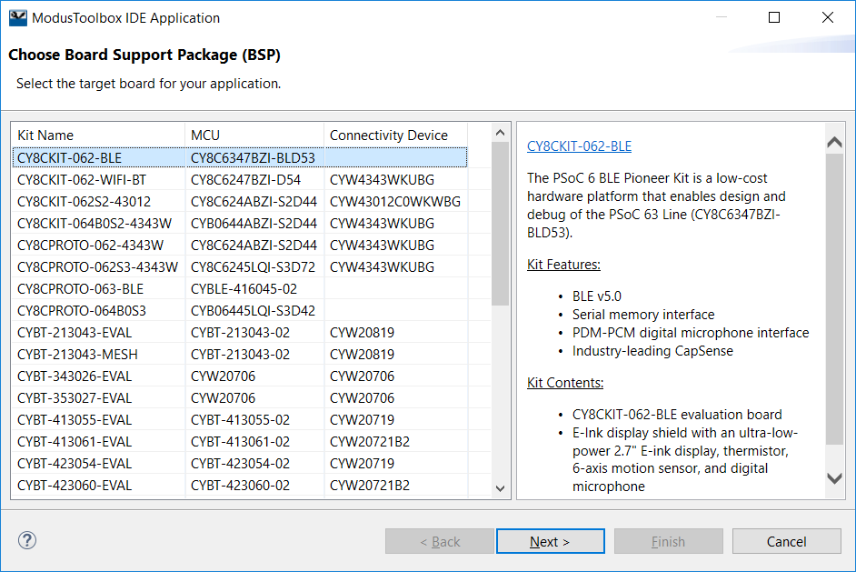

# PSoC 6 MCU : Advanced Sector Protection Technique in S25FL512S NOR Flash interfaced with PSoC 6

This project demonstrates Advanced Sector Protection technique in S25FL512S NOR Flash. It shows the behavior of flash in Password Protection Mode.

The Password Protection Mode can be enabled by programming a 64-bit password to the flash and setting the ASP Register bit [2] to zero. The password can be read and verified till the ASP register has not been programmed. Once ASP register has been programmed, the password can no longer be read. In the Password Protection Mode, the PPB array remains locked by default at POR or hardware reset. The Password Unlock command PASSU (E9h) along with the correct password is required to unlock the PPB array. After unlocking, the PPB bits can be programmed or erased. The PPB bits remain unlocked till the next power cycle.


## Requirements

- [ModusToolbox™ IDE](https://www.cypress.com/products/modustoolbox-software-environment) v2.0
- Programming Language: C
- Associated Parts: All [PSoC 6 MCU](http://www.cypress.com/PSoC6) parts

## Supported Kits

- [PSoC 6 BLE Pioneer Kit](https://www.cypress.com/CY8CKIT-062-BLE) (CY8CKIT-062-BLE)
- [PSoC 6 WIFI-BT Pioneer Kit](https://www.cypress.com/CY8CKIT-062-WIFI-BT) (CY8CKIT-062-WIFI-BT)
- [PSoC 6 WIFI-BT Prototyping Kit](https://www.cypress.com/CY8CPROTO-062-4343W) (CY8CPROTO-062-4343W)

## Hardware Setup

This example uses the board's default configuration. Refer to the kit user guide to ensure that the board is configured correctly.

## Software Setup

This example requires a serial terminal emulator such as PuTTY or Tera Term. The instructions in this document use Tera Term as the terminal emulator.

## Using the Code Example

### Importing the example:
Here are the steps to import the projects into Eclipse IDE workspace

1. Clone the projects using the command:
  ```
  git clone https://github.com/cypresssemiconductorco/Community-Code-Examples.git
  ```
**Figure 1. Git clone in CLI**


2. You will find the code example in the path _memory_interfacing/Advanced_Sector_Protection/_

3. Open ModusToolbox and create a workspace folder of your choice.

4. Once the Eclipse IDE is open, click **New Application** > **Choose BSP**. Select the BSP and click on **Next >**.

**Figure 2. Project Creator**



5. Click on **Import** button as shown below and point to the directory containing the Makefile of the code example. Once selected, you should see the name of the example visible under Application Name as shown below:

**Figure 3. Import Project**


6. Click on **Next >** and then **Finish**.

### Running the example:

1. Open the Library Manager to choose the Active BSP and then click **Apply**.

2. Clean your application (mandatory step)

3. Build your application.

4. Program the device.

## Steps performed by the example:

1. Initialize UART and QSPI

2. Read Device ID

3. Read Status Register

4. Erase all PPB bits *

5. Read ASP Register

6. If password protection mode is not enabled

   1. Read current password
   2. Program new password **
   3. Read password again to confirm
   4. Program ASP Register to enable passowrd protection
   5. Read ASP Register to confirm

7. Else if password protection is enabled

   1. Read PPB bits for any sector and confirm that the sector is unprotected
   2. Erase the sector and program it with new data. Read the data to confirm 
   3. Unlock the PPB bits using the password
   4. Perform PPB program operation to protect the programmed sector
   5. Erase the flash memory sector
   6. Read Status Register to confirm erase error
   7. Read the sector to confirm unsuccessful erase
   8. Erase all PPB bits
   9. Erase the flash memory sector
   10. Read the sector again to confirm successful erase
   
*Note : PPB bits are erased before enabling password protection to avoid unnecessary sector protection. This part of code should be removed when running the code example on a flash device where password protection mode has already been enabled. Not removing this part will cause erase error resulting in the E_ERR bit of Status Register getting set.

**Note : For ease of programming, the code example currently sets the password to 00000000. Example may be edited by users to set the desired password before programming. A global variable has been defined to store the desired password to be programmed.

## Expected Output:

**Figure 4. Final output**


