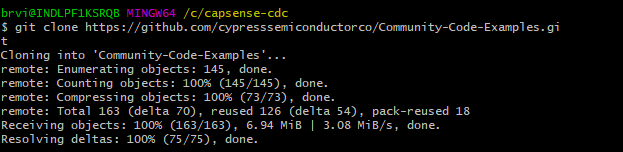
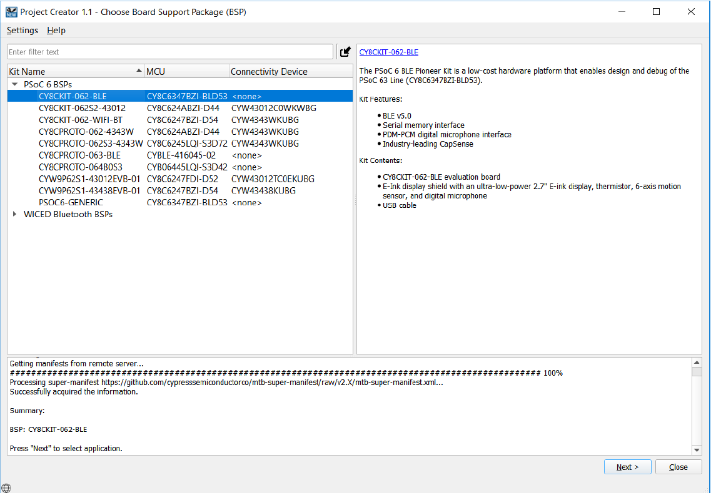
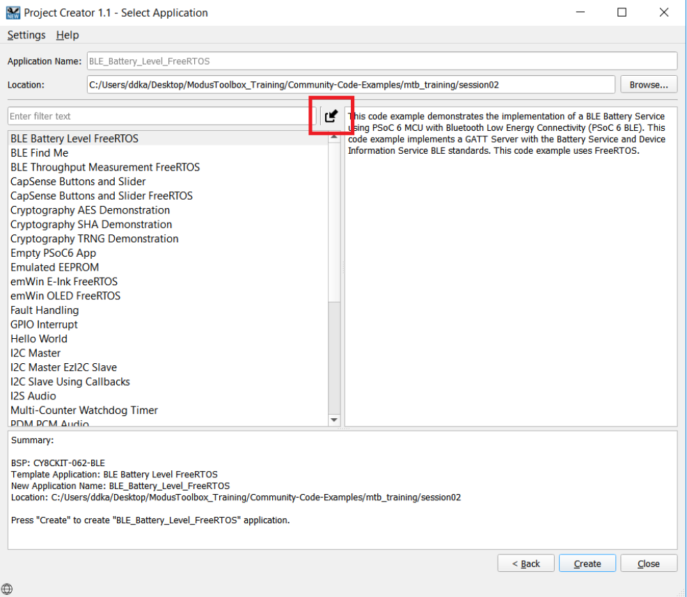
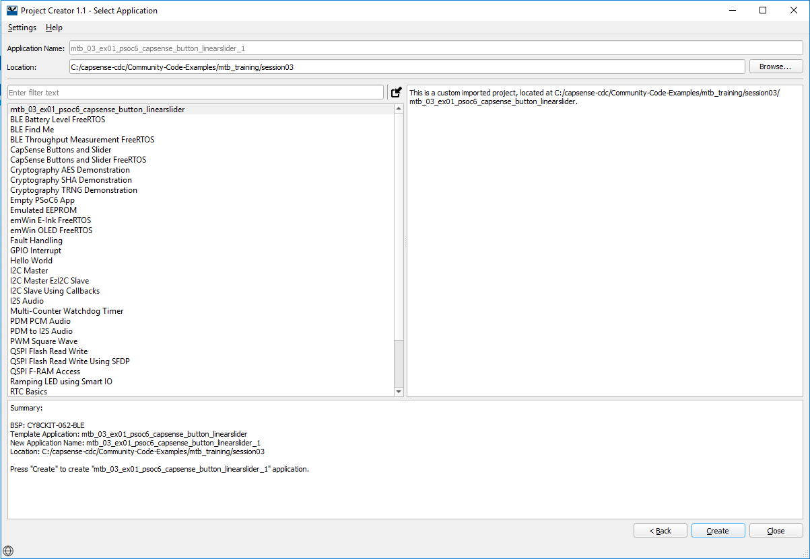
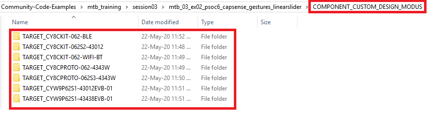

# Introduction to CapSense in ModusToolbox

This repository contains exercises covered in the third session of trainings on ModusToolbox. It contains two exercises:

1. **mtb_03_ex01_psoc6_capsense_button_linearslider** - This code example features a 5-segment CapSense slider and two CapSense buttons. Button 0 turns the LED ON, Button 1 turns the LED OFF, and the slider controls the brightness of the LED. The code example also demonstrates interfacing with Tuner GUI using I2C interface. This project uses the [CapSense Middleware Library](https://github.com/cypresssemiconductorco/capsense).

2. **mtb_03_ex02_psoc6_capsense_gestures_linearslider** - This code example features a 5-segment CapSense slider. This example demonstrates the implementation of gesture detection in PSoC® 6 with a CapSense® linear slider using [CapSense Middleware Library](https://github.com/cypresssemiconductorco/capsense).

## Supported Kits
- [PSoC 6 Wi-Fi BT Prototyping Kit](https://www.cypress.com/CY8CPROTO-062-4343W) (CY8CPROTO-062-4343W) - Default target
- [PSoC 6 WiFi-BT Pioneer Kit](https://www.cypress.com/CY8CKIT-062-WiFi-BT) (CY8CKIT-062-WiFi-BT)
- [PSoC 6 BLE Pioneer Kit](https://www.cypress.com/CY8CKIT-062-BLE) (CY8CKIT-062-BLE)
- [PSoC 62S2 Wi-Fi BT Pioneer Kit](https://www.cypress.com/CY8CKIT-062S2-43012) (CY8CKIT-062S2-43012)
- [PSoC 62S1 Wi-Fi BT Pioneer Kit](https://www.cypress.com/CYW9P62S1-43438EVB-01) (CYW9P62S1-43438EVB-01)
- [PSoC 62S1 Wi-Fi BT Pioneer Kit](https://www.cypress.com/CYW9P62S1-43012EVB-01) (CYW9P62S1-43012EVB-01)
- [PSoC 62S3 Wi-Fi BT Prototyping Kit](https://www.cypress.com/CY8CPROTO-062S3-4343W) (CY8CPROTO-062S3-4343W)


## Supported Software
* [ModusToolbox 2.1](https://www.cypress.com/products/modustoolbox-software-environment)

## Using the Material
The file _CapSense_MTB_Training.pdf_ has the slides used in the training. The step by step instructions to import the exercises is provided below.

### Importing the exercises:
Here are the steps to import the projects into Eclipse IDE workspace

1. Clone the projects using the command:
  ```
  git clone https://github.com/cypresssemiconductorco/Community-Code-Examples.git
  ```
**Figure 1. Git clone in CLI**



2. You will find all the exercises in the path mtb_training/session03/ as shown in Figure 2

**Figure 2. Exercises under session 3**


3. Open ModusToolbox and create a workspace folder of choice.

4. Once the Eclipse IDE is open, click New Application > Choose BSP.

**Figure 3. Project Creator**



5. Click the Import symbol as shown below:



6. Point to the directory of the exercise containing the Makefile. Once selected you should see the name of the exercise visible under Application Name as shown below:



7. Click Create and then Close.

8. By default, design.modus, and the GeneratedSource produced from it, are provided by the BSP. However, there may be cases where the application needs to modify the contents of design.modus. Therefore, the code example must provide a custom design.modus file for each target that it supports.

    1. Remove the **BSP_DESIGN_MODUS** component from the application definition
      build system example: add the following to Makefile:
        ```
        DISABLE_COMPONENTS+=BSP_DESIGN_MODUS
        COMPONENTS+=CUSTOM_DESIGN_MODUS
        ```

    2. Create a target folder for each board that the example supports.

    3. In each target folder, copy the design.modus from the BSP for that target. Then customize design.modus as required for the application.

    **Note:** All these modifications are already performed for you in the project **mtb_03_ex01_psoc6_capsense_button_linearslider** which modified the design.modus file to enable gestures in the capsense configurator.



### Running the exercises:

1. Open the Library Manager to choose the Active BSP and then click Apply.

2. Clean your application (mandatory step)

3. Build your application.

4. Program the device.

### Expected Output:

**mtb_03_ex01_psoc6_capsense_button_linearslider**

1. To test the application touch button 1 to turn OFF the LED, touch button 0 to turn the LED ON, and touch the slider in different positions to change the brightness when LED is ON.
2. For monitoring CapSense data, CapSense parameter tuning and SNR measurement, see [CapSense Tuner Guide](https://www.cypress.com/file/504381/download). See [AN85951 – PSoC 4 and PSoC 6 MCU CapSense Design Guide](https://www.cypress.com/documentation/application-notes/an85951-psoc-4-and-psoc-6-mcu-capsense-design-guide) for more details on selecting the right tuning parameters.

**mtb_03_ex02_psoc6_capsense_gestures_linearslider**

1. Do a fast click on any one of the slider segment and confirm that the RED LED turns ON; doing this again will turn OFF the LED.

2. Flick your finger across the slider starting on the left-hand side and slide right quickly, confirm that the GREEN LED turns ON; doing this again will turn OFF the LED.

3. Flick your finger across the slider starting on the right-hand side and slide left quickly, confirm that the BLUE LED connected to turns ON doing this again will turn OFF the LED.