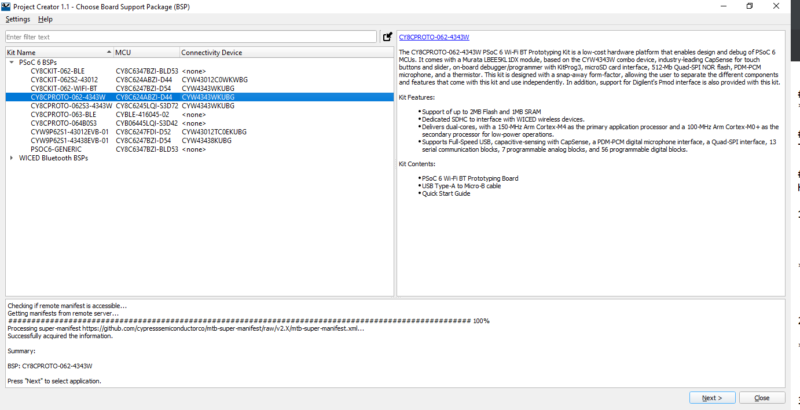
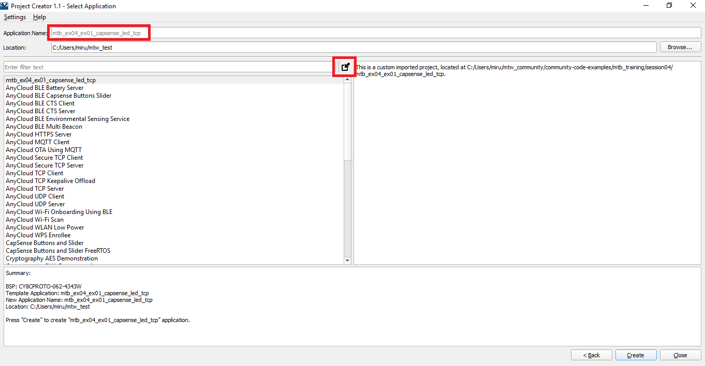
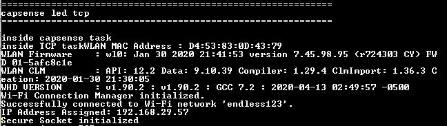
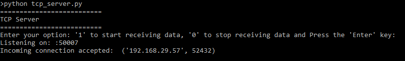
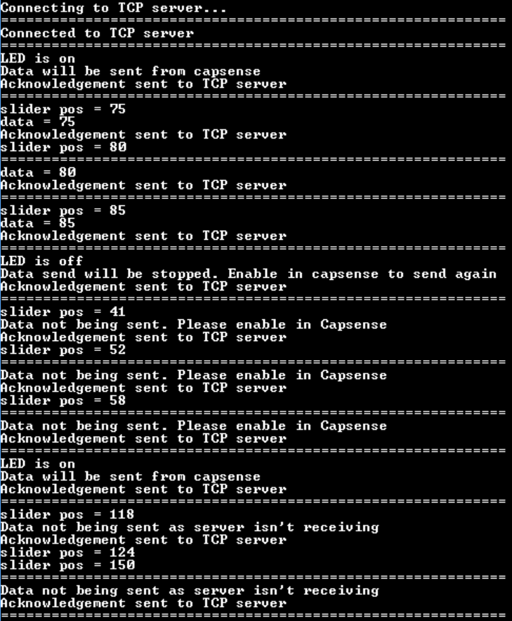
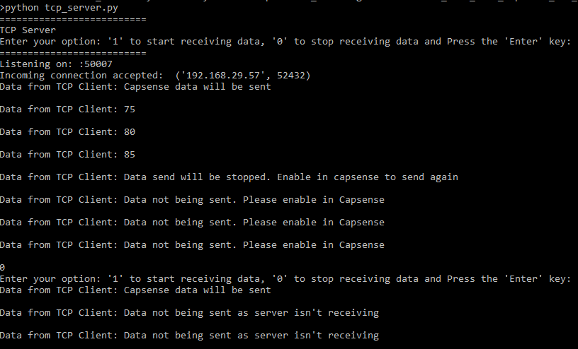

## Introduction to Wi-Fi in AnyCloud (MTB2.1)

This repository contains the exercise covered in the fourth session of trainings on AnyCloud. It contains the mtb_ex04_ex01_capsense_led_tcp which demonstrates on how to set up a basic (without TLS) TCP connection and send the data read using the capsense buttons and the capsense slider to a TCP server written using python running on a Personal Computer. As a garnish to the example the user LED's brightness also varies depending upon the data read from the capsense.

## Supported Kits

- [PSoC 6 Wi-Fi BT Prototyping Kit](https://www.cypress.com/CY8CPROTO-062-4343W) (CY8CPROTO-062-4343W) - Default target
- [PSoC 62S2 Wi-Fi BT Pioneer Kit](https://www.cypress.com/CY8CKIT-062S2-43012) (CY8CKIT-062S2-43012)
- [PSoC 6 WiFi-BT Pioneer Kit](https://www.cypress.com/CY8CKIT-062-WiFi-BT) (CY8CKIT-062-WIFI-BT)

## Supported Software
* [ModusToolbox 2.1](https://www.cypress.com/products/modustoolbox-software-environment)

## Using the Material
The file _AnyCloud_WiFi_Design_Flow.pdf_ has the slides used in the training. The step by step instructions to import the exercises is provided below.

## Software Setup
- Install a terminal emulator if you don't have one. Instructions in this document use [Tera Term](https://ttssh2.osdn.jp/index.html.en).

- Install a Python Interpreter if you don't have one. This code example is tested using [Python 3.7.7](https://www.python.org/downloads/release/python-377/), but other versions should work.


## Using the Code Example

### To import to ModusToolbox IDE

1. Clone the projects using the command:
  ```
  git clone https://github.com/cypresssemiconductorco/Community-Code-Examples.git
  ```
2. You will find the exercise in the path community-code-examples/mtb_training/session04/

3. Open ModusToolbox and create a workspace folder of your choice.

4. Once the Eclipse IDE is open, click New Application > Choose BSP.

**Figure 1. Project Creator**



5. Click the Import symbol (the arrow) as shown below and once you select the required project, the project name should appear as shown:

**Figure 2. Import Project**


6. Click Create and then Close.

## Operation

1. Open the Library Manager to choose the Active BSP and then click apply.

2. Clean your application (mandatory step)

3. Connect the board to your PC using the provided USB cable through the KitProg3 USB connector.

4. Modify `WIFI_SSID`, `WIFI_PASSWORD`, and `WIFI_SECURITY_TYPE` macros to match with that of the Wi-Fi network credentials that you want to connect. These macros are defined in the *source/tcp_client.h* file. Ensure that the Wi-Fi network that you are connecting to is configured as a private network for the proper functioning of this example.

5. Ensure your computer is connected to the same Wi-Fi access point that you have configured in step 4.

6. Determine the computer's IP address.

   Type the following command in the command shell based on your operating system to determine the IP address:

   Windows: `ipconfig`

   Linux: `curl ifconfig.me`

   macOS: `ifconfig |grep inet`
   

7. Change the `TCP_SERVER_IP_ADDRESS` macro defined in the *source/tcp_client.h* file to match with the computer's IP address. For example, if your computer's IP address is  192.168.29.134, then update the macro as shown below:

   ```
   #define TCP_SERVER_IP_ADDRESS             MAKE_IPV4_ADDRESS(192, 168, 29, 134)      
   ```

8. Open a terminal program and select the KitProg3 COM port. Set the serial port parameters to 115200 baud.

9. Ensure that the Python interpreter (see **Software Setup**) is installed on your computer.

10. Open a command shell from the project directory and run the Python TCP server (*tcp_server_script/tcp_server.py*). In the command shell opened in the project directory, type in the following command:

   ```
   python tcp_server.py
   ```

   **Note:** Ensure that the firewall settings of your computer allow access to the Python software so that it can communicate with the TCP client. For more details on enabling Python access, refer to this community [thread](https://community.cypress.com/thread/53662).

   
11. Program the board.


   - **Using Eclipse IDE for ModusToolbox**:

      1. Select the application project in the Project Explorer.

      2. In the **Quick Panel**, scroll down, and click **\<Application Name> Program (KitProg3)**.


   - **Using CLI**:

     From the terminal, execute the `make program` command to build and program the application using the default toolchain to the default target. You can specify a target and toolchain manually:
    
   ```
   make program TARGET=<BSP> TOOLCHAIN=<toolchain>
   ```

   Example:


   ```
   make program TARGET=CY8CPROTO-062-4343W TOOLCHAIN=GCC_ARM
   ```
         

   **Note**:  Before building the application, ensure that the *deps* folder contains the BSP file (*TARGET_xxx.lib*) corresponding to the TARGET. Execute the `make getlibs` command to fetch the BSP contents before building the application.

   After programming, the application starts automatically. Confirm that the following text as shown in Figure 3 is displayed on the UART terminal. Note that Wi-Fi SSID and the IP address assigned will be different based on the network that you have connected to.

   **Figure 3. UART Terminal Showing the Wi-Fi Connectivity Status**

   


12. From the Python TCP server, send the command to enable/disable the reception of the data read from the capsense.(The example attached prints the data saying that 'Data not being sent as server is not receiving'. This data sent from the client can be disabled). On the TCP client, if the data transmission is enabled by clicking the CapSense button, the slider data read will be transmitted; if disabled, a message 'Data not being sent. Please enable in Capsense' is transmitted when the capsense slider is touched. Below are the examples of the same.

      **Figure 4. TCP Server Initialization**

      

      **Figure 5. TCP Client Output**

       

      **Figure 6. TCP Server Output**

      


## Design and Implementation

In this project, PSoC 6 MCU scans a self-capacitance (CSD) based, 5-element CapSense slider and two mutual capacitance (CSX) CapSense buttons for user input. Based on the user input, the LED state is controlled along with either enabling or disabling the TCP client to transmit the Capsense slider data. A PWM HAL resource is configured for controlling the brightness of the LED.

The firmware uses FreeRTOS and lwIP to execute the tasks required by this application. The following tasks are created:
1. *CapSense task*: Initializes the CapSense Hardware block, processes the touch input, and sends a command to the LED task to update the LED status.
2. *LED task*: Initializes the TCPWM in PWM mode for driving the LED and updates the status of the LED based on the received command. 
3. *TCP client task*: Initializes the Wi-Fi Connection Manager, the Secure Sockets Library and establishes a conenection to a TCP server if its running and waits for the server to give the go ahead for the client to start transmission of data. This is achieved through a callback function defined in the tcp client.c 

A FreeRTOS-based timer is used for making the capsense scan periodic; a queue is used for communication between the CapSense task, LED task and the TCP client task. *FreeRTOSConfig.h* contains the FreeRTOS settings and configuration.