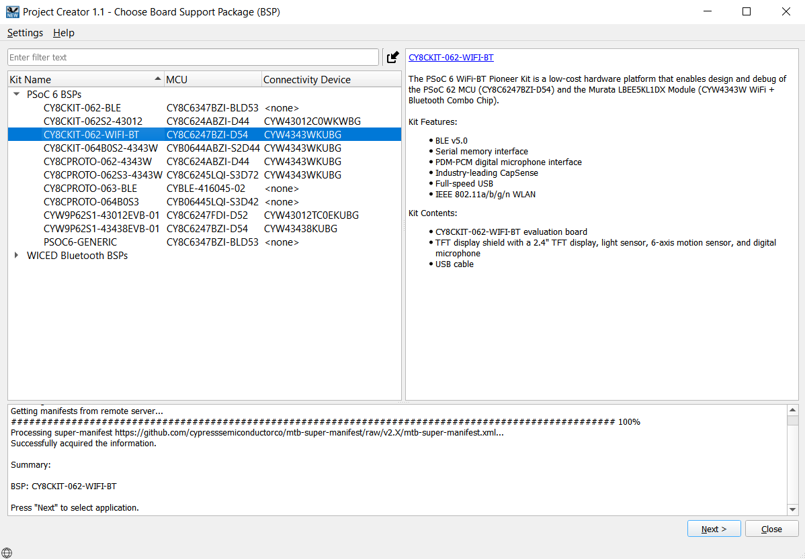
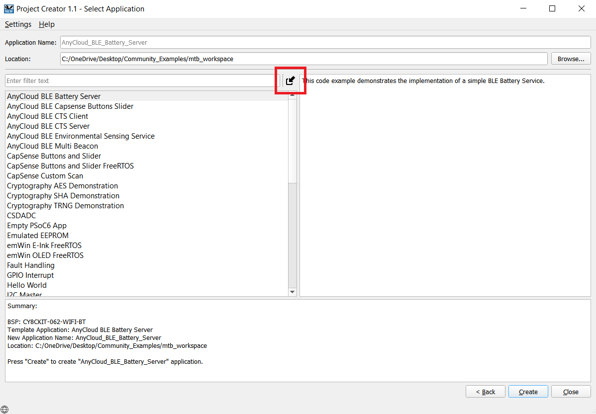
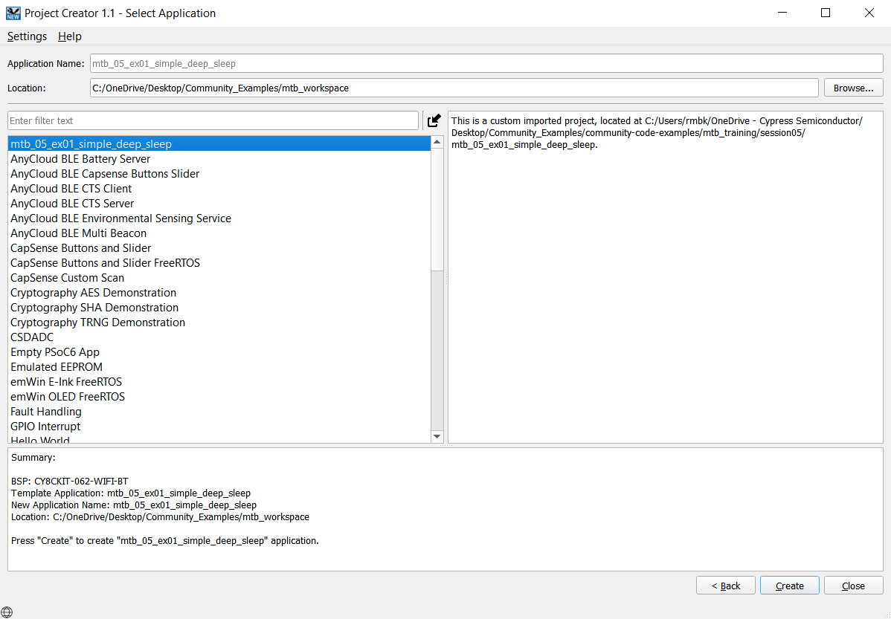

# Importing the exercises:
Here are the steps to import the applications into Eclipse IDE workspace

1. Clone the applications using the command:
  ```
  git clone https://github.com/cypresssemiconductorco/Community-Code-Examples.git
  ```

2. You will find all the exercises in the path community-code-examples/mtb_training/session05/

3. Open ModusToolbox and create a workspace folder of choice.

4. Once the Eclipse IDE is open, click New Application > Choose BSP.



5. Click the Import symbol as shown below:



6. Point to the directory of the example containing the Makefile. Once selected you should see the name of the exercise visible under Application Name as shown below:



7. Click Create and then Close.

### Importing using CLI:

1. Download and unzip this repository onto your local machine, or clone the repository.

2. Open a CLI terminal and navigate to the application folder. 
   
   On Linux and macOS, you can use any terminal application. On Windows, navigate to the modus-shell directory (*{ModusToolbox install directory}/tools_\<version>/modus-shell*) and run *Cygwin.bat*.

3. Import required libraries by executing the `make getlibs` command.

## Running the exercises:

1. Open the Library Manager to choose the Active BSP and then click Apply.

2. Clean your application (mandatory step)

3. Build your application.

4. Program the device.

5. After programming, the application starts automatically. 

### Using CLI:

From the terminal, execute the `make program` command to build and program the application using the default toolchain to the default target. You can specify a target and toolchain manually:

  ```
  make program TARGET=<BSP> TOOLCHAIN=<toolchain>
  ```
  
  Example: 
  ```
  make program TARGET=CY8CPROTO-062-4343W TOOLCHAIN=GCC_ARM
  ```

  **Note:**  
  * Before building the application, ensure that the *deps* folder contains the BSP file (*TARGET_xxx.lib*) corresponding to the TARGET. 
  * If your TARGET BSP file does not exist in the *deps* folder, run `make modlibs` to open the Library Manager and add your target BSP.
  * Execute the `make getlibs` command to fetch the BSP contents.
  * Follow the instructions in the next section to modify the **Device Configurator** settings and build the application.

## Using the exercises for different Target devices:

By default, design.modus, and the GeneratedSource produced from it, are provided by the BSP. However, there may be cases where the application needs to modify the contents of design.modus. Therefore, the code example must provide a custom design.modus file for each target that it supports.

  1. Remove the **BSP_DESIGN_MODUS** component from the application definition
    build system example: add the following to Makefile:
      ```
      DISABLE_COMPONENTS+=BSP_DESIGN_MODUS
      COMPONENTS+=CUSTOM_DESIGN_MODUS
      ```

  2. Create a target folder for each board that the example supports.

  3. In each target folder, copy the design.modus from the BSP for that target. Then customize design.modus as required for the application.

All these modifications for the default target i.e., CY8CKIT-062-WiFi-BT, are already performed for you in the applications that use a custom design.modus file. If you wish to use the application on a different target device, then replicate all the **Device Configurator** settings from the default target's custom design.modus file to design.modus of your target device. Here are some guidelines that you might use as a reference:

**Note:** These steps are optional and are done to further reduce the device current consumption. The application works even with the default BSP and the functionality remains intact even if these steps are skipped.

* Disable all the default unused peripherals like CSD etc.
* Disable all GPIOs.
* In the **System** tab, disable **Debug** capability.
* In the **Low Power Assistant**, set **Minimum Current Buck** as the **Core Regulator**.
* In the **System Clocks** section, disable all resources except IMO, PATH_MUX0, CLK_HF0, CLK_FAST, CLK_PERI, CLK_SLOW.
* Ensure that all resources are disabled in **Peripheral-Clocks** and **DMA** tabs.


