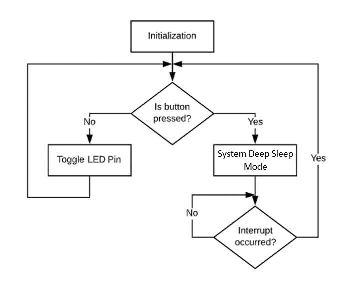

# PSoC 6 MCU: Simple Deep Sleep

This example demonstrates how to transition to System Deep Sleep mode. The application toggles the USER LED every 1 second and when a USER BUTTON is pressed it transitions the device to System Deep Sleep mode using only a single HAL API.

## Requirements

- [ModusToolbox™ software](https://www.cypress.com/products/modustoolbox-software-environment) v2.1
- Programming Language: C

## Supported Kits

- [PSoC 6 WiFi-BT Pioneer Kit](https://www.cypress.com/CY8CKIT-062-WiFi-BT) (CY8CKIT-062-WiFi-BT)

## Hardware Setup

This example can be used with the board's default configuration. See the kit user guide to ensure that the board is configured correctly.

The current consumed by the device can further be reduced by removing the resistor **R86** which causes a leakage of about 3 μA on VBACKUP domain that is connected to VTARG.

## Software Setup

This example requires no additional software or tools.

## Using the Code Example

Please refer to [IMPORT.md](IMPORT.md) for importing the application and programming the device.

## Operation

1. Once the device is programmed, the USER LED will be toggling every 1 second.

2. Press the kit's USER BUTTON. The USER LED stops blinking and the device transitions to System Deep Sleep mode.

3. Press the kit's USER BUTTON again to wake the device to System Low Power, CPU Active mode. The USER LED starts blinking again.

4. Refer to the device kit guide to know how to measure current consumed by the device. For CY8CKIT-062-WiFi-BT, connect the ammeter across the J8 current measurement jumper. 

## Design and Implementation

The firmware flow of the application is as shown in Figure 1.

**Figure 1. Firmware Flow**

1. The application initializes the USER LED and USER BUTTON GPIOs. 

2. An interrupt is registered for the USER BUTTON which is triggered when the user presses the button.

3. When the device is programmed, the USER LED toggles every 1 second. If the USER BUTTON is pressed, the device goes into System Deep Sleep mode and waits for an interrupt.

4. When the USER BUTTON is pressed again, the device wakes up and transitions to CPU Active mode.

5. For CY8CKIT-062-WiFi-BT running this application, the current consumed by the device in System Deep Sleep mode will be around 18 uA.

