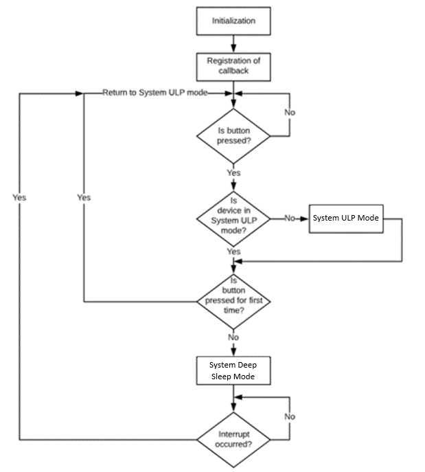

# PSoC 6 MCU: Deep Sleep

This example shows how to transition to System Deep Sleep mode. The example uses a timer to toggle the USER LED every 1 second and a USER BUTTON to transition the device to low power mode.

## Requirements

- [ModusToolbox™ software](https://www.cypress.com/products/modustoolbox-software-environment) v2.1
- Programming Language: C

## Supported Kits

- [PSoC 6 WiFi-BT Pioneer Kit](https://www.cypress.com/CY8CKIT-062-WiFi-BT) (CY8CKIT-062-WiFi-BT)

## Hardware Setup

This example can be used with the board's default configuration. See the kit user guide to ensure that the board is configured correctly.

The current consumed by the device can further be reduced by removing the resistor **R86** which causes a leakage of about 3 μA on VBACKUP domain that is connected to VTARG.

## Software Setup

This example requires no additional software or tools.

## Using the Code Example

Please refer to [IMPORT.md](IMPORT.md) for importing the application and programming the device.

## Operation

1. Once the device is programmed, the USER LED will be toggling every 1 second.

2. Press the kit's USER BUTTON. When the USER BUTTON is pressed for the first time, the green LED turns on for 2 seconds to indicate that the device successfully transitioned to System Ultra Low Power but failed to transition to System Deep Sleep mode. The blinking of USER LED continues.

3. Press the kit's USER BUTTON another time. The green LED turns on for 100 ms to indicate that the device is transitioning to System Deep Sleep mode and the toggling of the USER LED stops.

4. Press the kit's USER BUTTON for the third time to wake the device from System Deep Sleep mode to System ULP, CPU Active mode. The green LED turns on again for 100 ms and the USER LED starts blinking again.

5. Refer to the device kit guide to know how to measure current consumed by the device. For CY8CKIT-062-WiFi-BT, connect the ammeter across the J8 current measurement jumper. 

## Design and Implementation

This example uses a custom BSP in which all unused resourses like unused peripherals, high speed clocks, debug capability etc., are disabled. The core regulator is set to minimum current buck regulator. The initial power mode of the device is System Low Power mode which is the default mode. To use this application for another target device, please refer to [IMPORT.md](IMPORT.md).

The example also uses a custom linker script to reduce the total RAM to 256 KB. To use a custom linker script, the path of the custom linker script is provided in the **LINKER_SCRIPT** variable in makefile. The path is relative to the makefile directory.

In the default linker script as a part of the BSP for the CY8CKIT-062-WiFi-BT kit, CM0+ is allocated  8  KB  (0x2000)  of  SRAM.  Hence,  in  order  to  retain  256  KB  of  SRAM,  the CM4 can use up to (256 KB – 8 KB) = 248 KB of SRAM. Therefore,  in  the  custom  linker  script,  the  RAM  allocated  to CM4 is changed to 248 KB (0x3E000) as shown.

```
ram               (rwx)   : ORIGIN = 0x08002000, LENGTH = 0x3E000
```

The firmware flow of the application is as shown in Figure 1.

**Figure 1. Firmware Flow**



1. The application initializes all the GPIOs - Green LED, USER LED, USER BUTTON, and a timer with period set to 1 second to toggle the USER LED.

2. An interrupt is registered for the USER BUTTON which is triggered when the user presses the button.

3. Along with this, a System Deep Sleep power mode transition callback is also used to:
    * In CHECK_READY mode stop the transition to System Deep Sleep if the button is pressed once or stop the timer if button is pressed for second time. Turn on the Green LED for 2 seconds when the transition fails to notify the user.
    * Disable unused RAM regions, disable UDB and turn on the Green LED for 100 ms in BEFORE_TRANSITION mode.
    * Turn on the Green LED for 100 ms and start the timer in AFTER_TRANSITION mode.

4. When the device is programmed, the USER LED toggles every 1 second. If the USER BUTTON is pressed, the device goes into System Ultra Low Power mode if it is not already.

5. The device then attempts to transition to System Deep Sleep mode and because the button is pressed for the first time the transition fails. The blinking of the USER LED continues and the device is now in System Ultra Low Power mode, CPU Active mode.

6. When the USER BUTTON is pressed for the second time, the device successfully transitions to System Deep Sleep mode and waits for an interrupt.

7. When the USER BUTTON is pressed again, the device wakes up and transitions to System ULP, CPU Active mode.

8. For CY8CKIT-062-WiFi-BT running this application, the current consumed by the device in System Deep Sleep mode will be around 10 uA.

