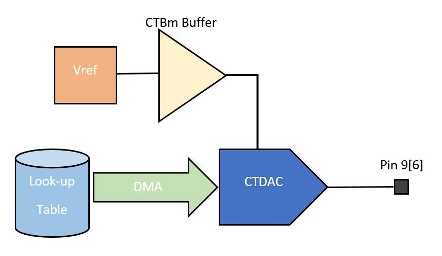

# PSoC 6 MCU: Sinewave using CTDAC

This example demonstrates how to generate a sine wave using the CTDAC component. The project uses a combination of device configurator and PDL APIs to achieve this. The voltage reference used as the reference for the CTDAC is the internal band-gap reference. The reference is buffered through internal CTBm opamps before before acting as CTDAC reference. 

## Requirements

- [ModusToolbox™ software](https://www.cypress.com/products/modustoolbox-software-environment) v2.1
- Programming Language: C

## Supported Kits

- [PSoC 6 WiFi-BT Pioneer Kit](https://www.cypress.com/CY8CKIT-062-WiFi-BT) (CY8CKIT-062-WiFi-BT)

## Hardware Setup

This example can be used with the board's default configuration. See the kit user guide to ensure that the board is configured correctly.

The sine-wave output is available in pin 9[6].

## Software Setup

This example requires no additional software or tools.

## Using the Code Example

Please refer to [Exercises_ReadMe.pdf](../Exercises_ReadMe.pdf) for importing the application and programming the device. Design.modus file needs to be replaced in this example.

## Operation

1. Program the device

2. Monitor pin 9[6] to see the waveform.

## Design and Implementation

**Figure 1. Block Diagram**

1. All the components are configured in design.modus

2. CTDAC is reference is set as internal Vref buffered through internal opamp.

3. CTBm block opamp is set as to act as buffer for internal reference to be connected to CTDAC as source.

4. DMA is configured to transfer 100 elements in the form of a descriptor, which transfers one element on each trigger.

5. The lookup table for sine wave is stored in 12 bit unsigned mode.

6. The components are initialized and enabled.

7. The DMA source and destination address are set as Lookup table address and CTDAC buffer address respectively.

8. The descriptor is looped back to itself for continuous wave generation

9. The maximum amplitude of the waveform will be dependent on the reference provided. Higher amplitude references can be provided (VDDA/External), keeping in mind that it is within maximum specifications

