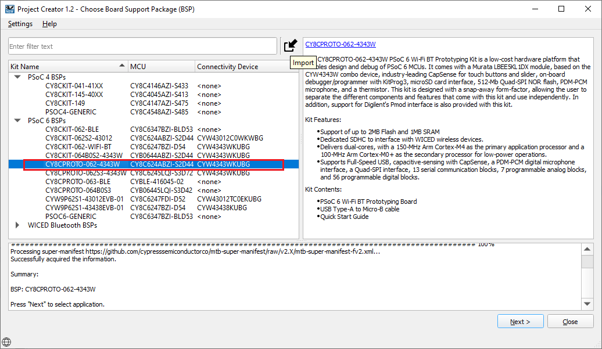
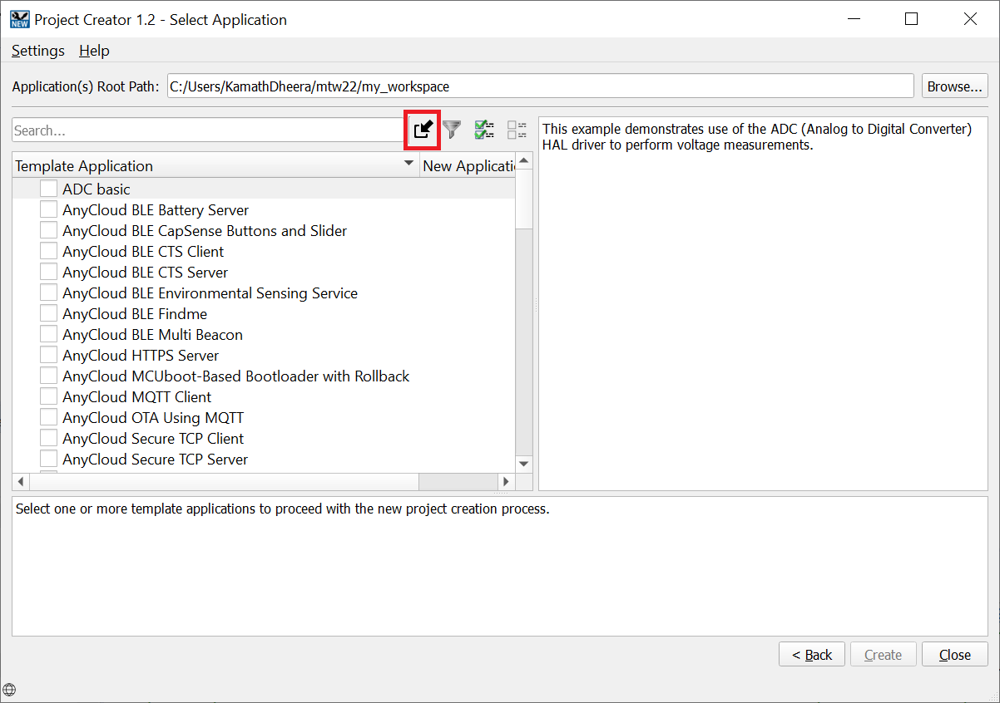
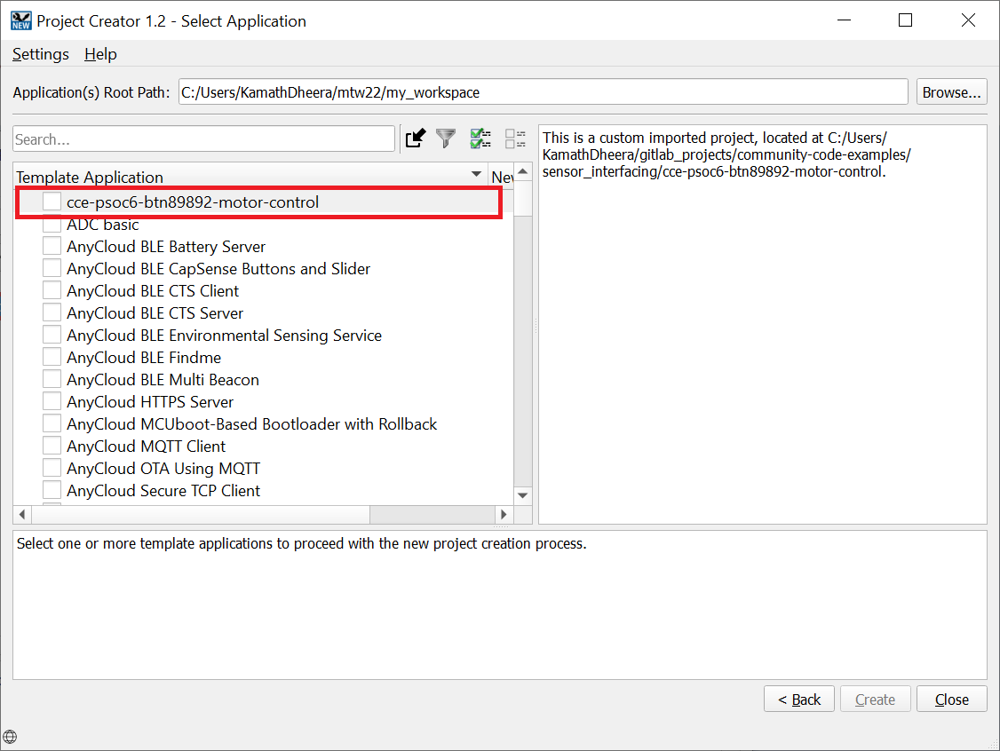

# Importing the exercises:
Here are the steps to import the projects into Eclipse IDE workspace

1. Clone the projects using the command:
  ```
  git clone https://github.com/cypresssemiconductorco/Community-Code-Examples.git
  ```

2. You will find the example project in the path: community-code-examples/sensor_interfacing/mtb-psoc6-btn8982-motor-control/

3. Open ModusToolbox and create a workspace folder of choice.

4. Once the Eclipse IDE is open, click New Application under the Quick Panel. 

5. Choose CY8CPROTO-062-4343W as the BSP and click Next.


6. Click the Import icon in the Select Application window.


7. Point to the project directory and click Select Folder. Select the checkbox next to __cce-psoc6-btn8982-motor-control__ application and click Create.


8. Once imported, click Generate Launches to generate the launch configurations for programming and debugging.

### Importing using CLI:

1. Download and unzip this repository onto your local machine, or clone the repository.

2. Open a CLI terminal and navigate to the application folder. 
   
   On Linux and macOS, you can use any terminal application. On Windows, navigate to the modus-shell directory (*{ModusToolbox install directory}/tools_\<version>/modus-shell*) and run *Cygwin.bat*.

3. Import required libraries by executing the `make getlibs` command.
