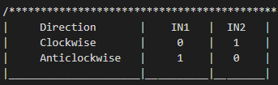
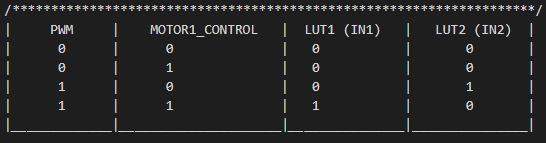
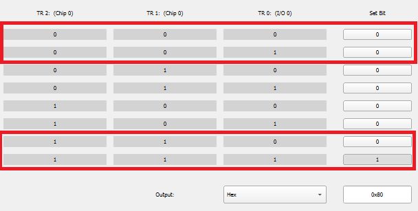
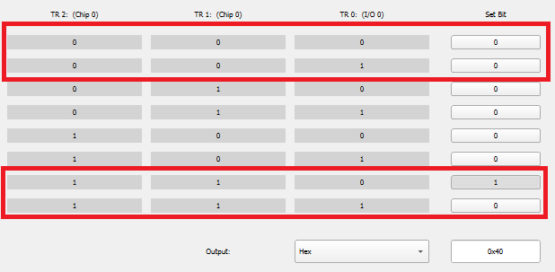
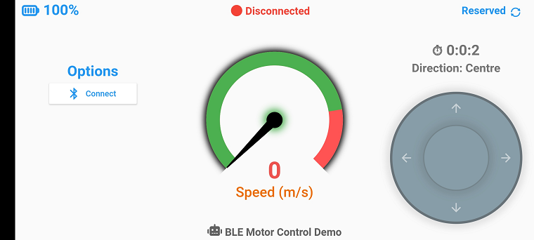
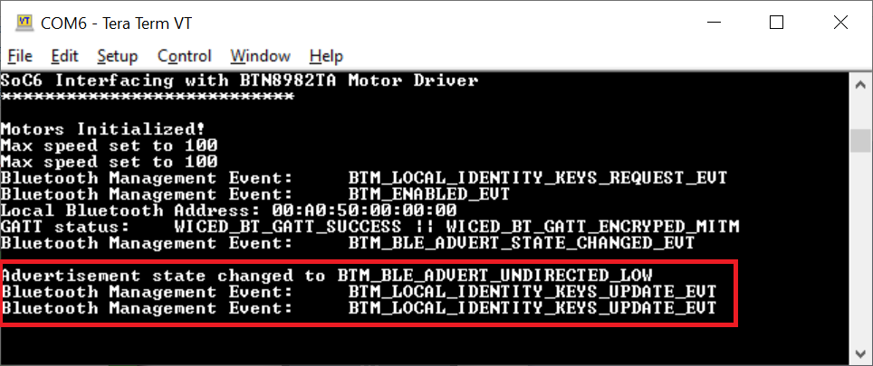
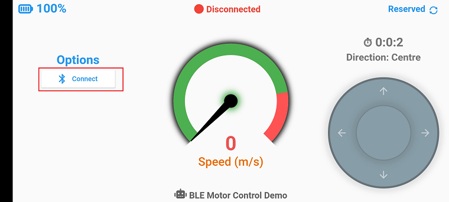
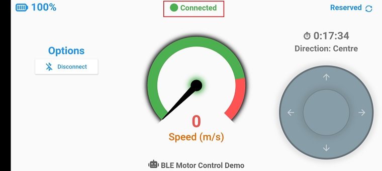
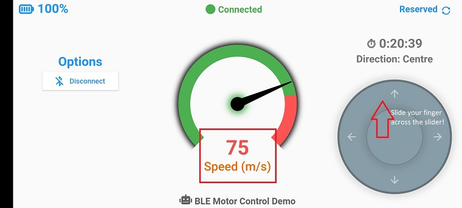
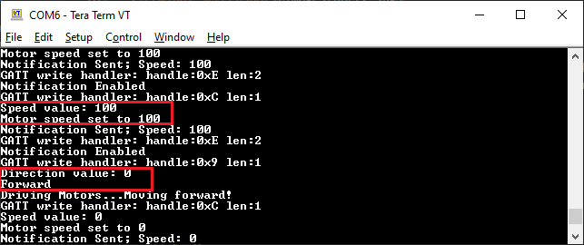

# Infineon BTN8982TA Motor Control using PSoC6 and Mobile App

This module contains the source code for interfacing PSoC6 with the Infineon [BTN8982TA Motor Control Shield](https://www.infineon.com/dgdl/Infineon-Motor_Control_Shield_with_BTN8982TA_for_Arduino-UM-v00_09-EN.pdf?fileId=5546d4624ca27d02014cb20b89867eed) to drive two 12V 3000 RPM High Torque Motors using a Mobile App!

## Requirements
- [BTN8982TA Motor Control Shield](https://www.infineon.com/dgdl/Infineon-Motor_Control_Shield_with_BTN8982TA_for_Arduino-UM-v00_09-EN.pdf?fileId=5546d4624ca27d02014cb20b89867eed)
- [PSoC 6 Wi-Fi BT Prototyping Kit](https://www.cypress.com/CY8CPROTO-062-4343W)
- [ModusToolbox™ software](https://www.cypress.com/products/modustoolbox-software-environment) v2.2

   **Note:** This code example version requires ModusToolbox software version 2.2 or later and is not backward compatible with v2.1 or older versions. If you cannot move to ModusToolbox v2.2, use the latest compatible version of this example: [latest-v1.X](https://github.com/cypresssemiconductorco/mtb-example-anycloud-ble-wifi-onboarding/tree/latest-v1.X).

- Board Support Package (BSP) minimum required version: 2.0.0
- Programming Language: C
- Associated Parts: [PSoC® 6 MCU](http://www.cypress.com/PSoC6) parts with CYW43012, CYW4343W
- Programming Language: C
- Associated Parts: [PSoC® 6 MCU](http://www.cypress.com/PSoC6) parts with BLE and SDIO, [CYW4343W](https://www.cypress.com/documentation/datasheets/cyw4343w-single-chip-80211-bgn-macbasebandradio-bluetooth-41)

## Supported Kits

- [PSoC 6 Wi-Fi BT Prototyping Kit](https://www.cypress.com/CY8CPROTO-062-4343W) (CY8CPROTO-062-4343W) - Default target

## Hardware Setup
Connections between PSoC6 and the Motor Shield:
* CY8CPROTO-062-4343W
   * P9[1] ---> Motor1 IN1
   * P9[2] ---> Motor1 IN2
   * P9[4] ---> Motor2 IN1
   * P9[7] ---> Motor2 IN2

Connections on the CY8CPROTO-062-4343W Kit: 
* P5[6] ---> P9[0] (connect jumper wire)
* P5[7] ---> P9[5] (connect jumper wire)

Connections on the Motor Shield:
* INH_1 and INH_2 pins should be connected to VTARG to enable the motors. 
* VBAT should be connected to the 12V battery 

## Working
Two PWMs are used to control the high-side and low-side switches of the motor driver. To control which of the switches need to be triggered, Smart-IO is used to control the logic based on the direction to be moved. 

For example: A motor can rotate in one of two directions; Clockwise and Anticlockwise.
Motor Shield takes two pins IN1 and IN2, one to each half bridge to control the direction of the motor. Each of the pins IN1 and IN2 need to be activated in the following manner for the different directions:



Based on the duty-cycle of the PWM, the speed of switching can be controlled to give variable speed to the motors. The two PWMs are configured to provide a period of 25KHz as mandated in the motor driver datasheet.

A control pin is used to switch between the two directions. Based on the logic of the control pin, the PWM output is transferred to the pins IN1 and IN2. 



LUT1 and LUT2 have the control logic to achieve this. Since the LUT takes three inputs, the PWM input is given to two, basically tying them together and the other to the control signal giving four choices as shown below.

LUT1 is configured as a combinatorial logic as follows to allow the PWM to reflect on the output when control pin is HIGH:



LUT2 is configured as a combinatorial logic as follows to allow the PWM to reflect on the output when control pin is LOW:



## Running the example project

1. Import the project into Eclipse IDE for ModusToolbox. Please refer to [IMPORT.md](IMPORT.md) for importing the application.

2. Clean your application

3. Build your application

4. Program the device

5. Transfer the motor_control.apk file from the mobile_app folder to your phone via USB

6. Install and run the App. You should see the app on your mobile screen as shown in the figure below:
   

7. Connect the kit via KitProg3 USB port to the PC

8. Open the UART Serial Terminal and set the baud rate to 115200

9. You will be notified in the terminal when BLE is advertising as shown:


10. Click Connect in the mobile app


11. The status at the top of the app will change to "Connected" when the connection is established.


12. Slide your finger on the Radial Slider at the bottom right to move in different directions. The further away from the centre, the higher the speed. The speed will be indicated by the Speed Gauge.


13. You can see the speed and direction values being written to the respective GATT Characterstic handlers.


## Modifying the Mobile App
The mobile app has been developed using the [Flutter UI Framework](https://flutter.dev/docs/get-started/install/windows). 

The app has been developed to connect to the BLE device named "BleMotor" and characteristic UUIDs specified in the BT Configurator. You can modify the device name and UUIDs if needed by editing the file "bot_ble.dart" in the path: mobile_app\source\lib\

### Using CLI:

From the terminal, execute the `make program` command to build and program the application using the default toolchain to the default target. You can specify a target and toolchain manually:

  ```
  make program TARGET=<BSP> TOOLCHAIN=<toolchain>
  ```
  
  Example: 
  ```
  make program TARGET=CY8CPROTO-062-4343W TOOLCHAIN=GCC_ARM
  ```

  **Note:**  
  * Before building the application, ensure that the *deps* folder contains the BSP file (*TARGET_xxx.lib*) corresponding to the TARGET. 
  * If your TARGET BSP file does not exist in the *deps* folder, run `make modlibs` to open the Library Manager and add your target BSP.
  * Execute the `make getlibs` command to fetch the BSP contents before building the application.  


After programming, the application starts automatically. 

