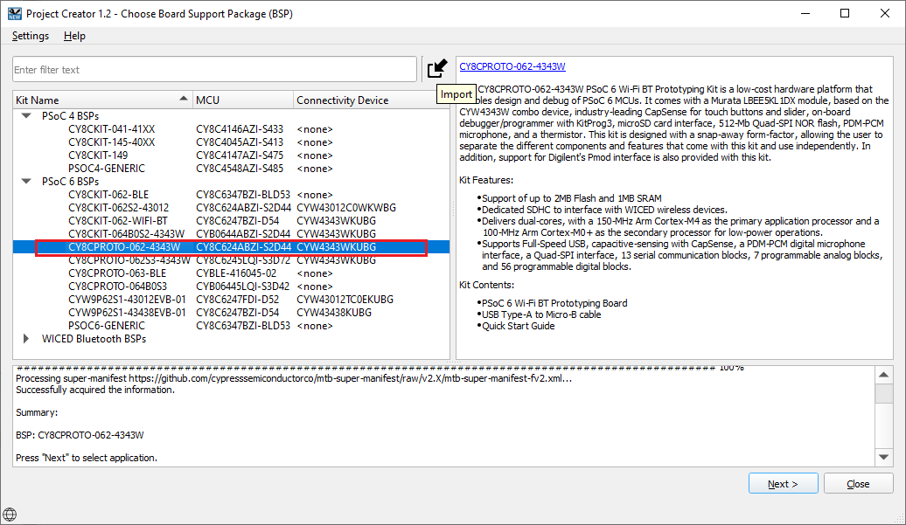
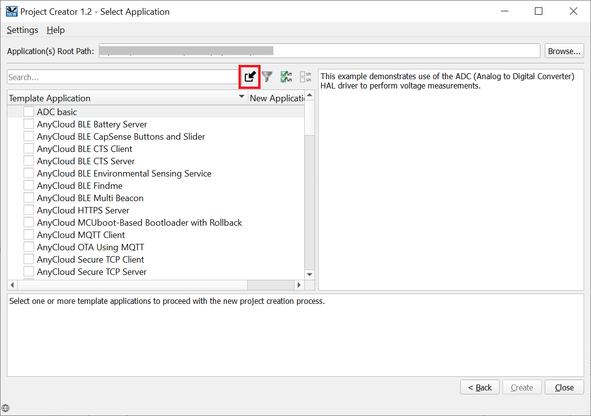
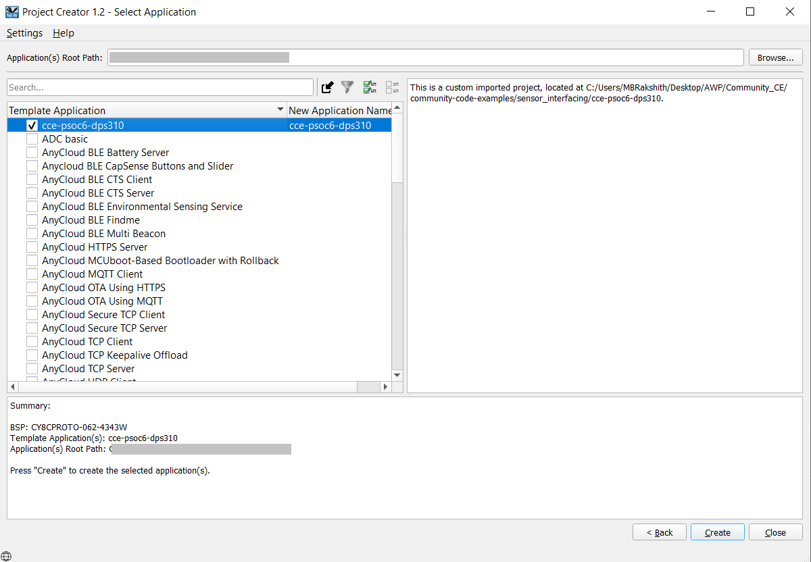

# Importing the exercises:
Here are the steps to import the projects into Eclipse IDE workspace

1. Clone the projects using the command:
  ```
  git clone https://github.com/cypresssemiconductorco/Community-Code-Examples.git
  ```

2. You will find the example project in the path: community-code-examples/sensor_interfacing/cce-psoc6-dps310/

3. Open ModusToolbox and create a workspace folder of choice.

4. Once the Eclipse IDE is open, click New Application under the Quick Panel. 

5. Choose CY8CPROTO-062-4343W as the BSP and click Next.


6. Click the Import icon in the Select Application window.


7. Point to the project directory and click Select Folder. Select the checkbox next to __cce-psoc6-dps310__ application and click Create.


8. Once imported, click Generate Launches to generate the launch configurations for programming and debugging.

### Importing using CLI:

1. Download and unzip this repository onto your local machine, or clone the repository.

2. Open a CLI terminal and navigate to the application folder. 
   
   On Linux and macOS, you can use any terminal application. On Windows, navigate to the modus-shell directory (*{ModusToolbox install directory}/tools_\<version>/modus-shell*) and run *Cygwin.bat*.

3. Import required libraries by executing the `make getlibs` command.

## Running the exercises:

1. Open the Library Manager to choose the Active BSP and then click Apply.

2. Clean your application (mandatory step)

3. Build your application.

4. Program the device.

### Using CLI:

From the terminal, execute the `make program` command to build and program the application using the default toolchain to the default target. You can specify a target and toolchain manually:

  ```
  make program TARGET=<BSP> TOOLCHAIN=<toolchain>
  ```
  
  Example: 
  ```
  make program TARGET=CY8CPROTO-062-4343W TOOLCHAIN=GCC_ARM
  ```

  **Note:**  
  * Before building the application, ensure that the *deps* folder contains the BSP file (*TARGET_xxx.mtb*) corresponding to the TARGET. 
  * If your TARGET BSP file does not exist in the *deps* folder, run `make modlibs` to open the Library Manager and add your target BSP.
  * Execute the `make getlibs` command to fetch the BSP contents before building the application.  


After programming, the application starts automatically.