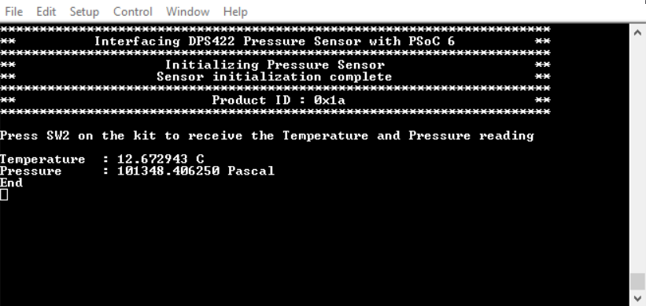

# Interfacing Infineon DPS422 Pressure Sensor with PSoC 6

This code example demonstrates the interfacing of Infineon DPS422 Pressure Sensor with PSoC® 6 MCU. The hardware used in this project are Infineon's Shield2Go [S2GO PRESSURE DPS422](https://www.infineon.com/cms/en/product/evaluation-boards/s2go-pressure-dps422/) evaluation board and PSoC 6-BLE Pioneer Kit [(CY8CKIT-062-BLE)](https://www.cypress.com/documentation/development-kitsboards/psoc-6-ble-pioneer-kit-cy8ckit-062-ble).

## Requirements

- [ModusToolbox® software](https://www.cypress.com/products/modustoolbox-software-environment) v2.2 
- Board Support Package (BSP) minimum required version: 2.0.0
- Programming Language: C
- Associated Parts: All [PSoC 6 MCU](http://www.cypress.com/PSoC6) parts

## Supported Kits (make variable 'TARGET')

- [PSoC 6 BLE Pioneer Kit](https://www.cypress.com/CY8CKIT-062-BLE) (`CY8CKIT-062-BLE`) - Default value of `TARGET`

## Hardware Setup

This example uses the board's default configuration. See the kit user guide to ensure that the board is configured correctly.

**Note**: The PSoC 6 BLE Pioneer Kit (CY8CKIT-062-BLE) and the PSoC 6 WiFi-BT Pioneer Kit (CY8CKIT-062-WIFI-BT) ship with KitProg2 installed. ModusToolbox software requires KitProg3. Before using this code example, make sure that the board is upgraded to KitProg3. The tool and instructions are available in the [Firmware Loader](https://github.com/cypresssemiconductorco/Firmware-loader) GitHub repository. If you do not upgrade, you will see an error like "unable to find CMSIS-DAP device" or "KitProg firmware is out of date".

Use jumper wires to establish a connection between the DPS422 Shields2Go evaluation board and the PSoC 6 kit as mentioned below - 

1. Connect 3.3V of sensor to 3V3 supply on the Kit.
2. Connect GND of sensor to GND of the Kit.
3. Connect the I2C lines - SCL and SDA of the sensor to P6[0] and P6[1] of the Kit respectively.

## Software Setup

Install a terminal emulator if you don't have one. Instructions in this document use [Tera Term](https://ttssh2.osdn.jp/index.html.en).

## Importing the example application

Please refer to [IMPORT.md](IMPORT.md) for importing the application

## Expected Output

1. Upon power-up, the example first initializes the PSoC 6 device, enables GPIO interrupt, and initializes UART and I2C.
2. The next step is the pressure sensor initialization. In this step calibration coefficients are read from the respective registers inside the sensor and all necessary constants are calculated and stored for future temperature and pressure measurement scaling. Measurement and oversampling rates are also initialzed.
3. Then the program waits to receive button press input from the user. Each time switch SW2 is pressed, the most recent temperature and pressure reading is displayed on the serial terminal, as shown in **Figure 1**.

**Figure 1 : Serial terminal output** 

