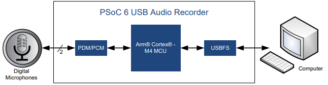

# Interfacing Infineon IM69D130 MEMS Microphone with PSoC 6

This example demonstrates how to interface [Infineon's MEMS Microphone (IM69D130) EVAL_IM69D130_FLEXKIT](https://www.infineon.com/cms/en/product/evaluation-boards/eval_im69d130_flexkit/) evaluation kit with PSoC 6 MCU using Eclipse IDE for ModusToolbox™. The application implements an audio recorder using the USB Audio Device Class.

## Overview

This code example shows how to stream audio data to a PC over USB using a PSoC 6 MCU device. The EVAL_IM69D130_FLEXKIT eval kit is equipped with a digital PDM output microphone, [IM69D130](https://www.infineon.com/cms/en/product/sensor/mems-microphones/im69d130/). The eval kit is interfaced to the PSoC 6 device using the pulse-density modulation (PDM) to pulse-code modulation (PCM) converter hardware block. Audio data captured by the microphones is streamed over USB Full-Speed (USBFS) using the Audio Device Class. An audio recorder software tool, such as [Audacity](https://www.audacityteam.org/), running on a computer initiates the streaming of audio data.

**Figure 1. Block Diagram**

To see the USB Audio descriptor, use the *usbdev-configurator* tool located at *<ModusToolbox_install_dir>/tools_\<version\>/usbdev-configurator*. In the tool, open the *design.cyusbdev* file located under the */COMPONENT_CUSTOM_DESIGN_MODUS/TARGET_\<BSP\>* folder. 

## Requirements

- [ModusToolbox® software](https://www.cypress.com/products/modustoolbox-software-environment) v2.2 
    
    **Note:** This code example version requires ModusToolbox software version 2.2 or later and is not backward compatible with v2.1 or older versions.
- Board Support Package (BSP) minimum required version: 2.0.0  
- Programming Language: C
- Associated Parts: All [PSoC 6 MCU](http://www.cypress.com/PSoC6) parts with USB

## Supported Toolchains (make variable 'TOOLCHAIN')

- GNU Arm® Embedded Compiler v9.3.1 (GCC_ARM) - Default value of `TOOLCHAIN`
- Arm compiler v6.11 (ARM)
- IAR C/C++ compiler v8.42.2 (IAR)

## Supported Kits

- [PSoC 6 WiFi-BT Pioneer Kit](https://www.cypress.com/CY8CKIT-062-WiFi-BT) (CY8CKIT-062-WIFI-BT)

## Hardware Setup

This code example uses the [Infineon's MEMS Microphone (IM69D130) EVAL_IM69D130_FLEXKIT](https://www.infineon.com/cms/en/product/evaluation-boards/eval_im69d130_flexkit/) evaluation kit.

Use jumper wires to establish a connection between the EVAL_IM69D130_FLEXKIT eval kit and the PSoC 6 device as mentioned below.

1. Connect 'V' terminal of eval kit to 3V3 supply on the PSoC 6 Kit.
2. Connect 'G' terminal of eval kit to GND of the PSoC 6 Kit.
3. Connect the PDM lines - Clock ('C') and Data ('D') of the eval kit to P9[4] and P9[5] in PSoC 6  kit respectively.
4. Connect 'S' terminal of eval kit to 3v3 supply for Right mode or GND for Left mode

**Note:** The PSoC 6 WiFi-BT Pioneer Kit (CY8CKIT-062-WIFI-BT) ship with KitProg2 installed. The ModusToolbox software requires KitProg3. Before using this code example, make sure that the board is upgraded to KitProg3. The tool and instructions are available in the [Firmware Loader](https://github.com/cypresssemiconductorco/Firmware-loader) GitHub repository. If you do not upgrade, you will see an error like "unable to find CMSIS-DAP device" or "KitProg firmware is out of date".

## Software Setup

Install an audio recorder software tool, such as [Audacity](https://www.audacityteam.org/).
Install a terminal emulator if you don't have one. Instructions in this document use [Tera Term](https://ttssh2.osdn.jp/index.html.en).

## Importing the example application

Please refer to [IMPORT.md](IMPORT.md) for importing the application

## Operation

1. Connect the board to your PC using the provided USB cable through the USB connector.

2. Program the board. After programming, the application starts automatically. Confirm that example project title is displayed on the UART terminal.

**Figure 2. Serial Output**

3. Connect another USB cable (or reuse the same cable used to program the kit) to the USB device connector (see the kit user guide for its location).

4. On the computer, verify that a new USB device was enumerated as a Microphone and named as "PSoC 6 USB Audio Recorder".

5. Open an audio recorder software tool in the computer. If you do not have one, download the open-source software [Audacity](https://www.audacityteam.org/). Make sure to select the correct microphone in the software tool.

6. Start a recording session. Speak over the microphone.

7. Stop the recording session and play it to confirm that the audio was recorded correctly.

## Design and Implementation

The PDM/PCM hardware block can sample one or two PDM digital microphones. In this application, the hardware block is configured to sample stereo audio at 48 ksps with 24-bit resolution. The sample audio data is eventually transferred to the USB data endpoint buffer. 

The USB descriptor implements the Audio Device Class with three endpoints:

- **Audio Control Endpoint:** controls the access to the audio streams
- **Audio IN Endpoint:** sends the data to the USB host
- **Audio OUT Endpoint:** receives the data from the USB host (not used in this application)

### Resources and Settings

**Table 1. Application Resources**

| Resource  |  Alias/Object     |    Purpose     |
| :------- | :------------    | :------------ |
| USBDEV (PDL) | CYBSP_USBDEV  | USB Device configured with Audio descriptor |
| PDM/PCM (HAL) | pdm_pcm | Interfaces with the microphone |

-------------------------------------------------------------------------------
