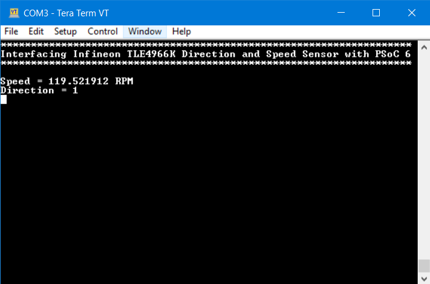

# Interfacing Infineon TLE4966K Direction and Speed Sensor with PSoC 6

This example demonstrates how to interface Infineon [TLE4966K Shields2Go](https://www.infineon.com/cms/en/product/evaluation-boards/s2go_2_hall_tle4966k/) evaluation kit with PSoC 6 using Eclipse IDE for ModusToolbox™. The library used in the example project is a port of the [Infineon TLx4966-Direction-Speed-Sensor Library](https://github.com/Infineon/TLx4966-Direction-Speed-Sensor). 

## Requirements

- [ModusToolbox® software](https://www.cypress.com/products/modustoolbox-software-environment) v2.2  
- Board Support Package (BSP) minimum required version: 2.0.0  
- Programming Language: C  
- Associated Parts: [PSoC® 6 MCU](http://www.cypress.com/PSoC6)

## Supported Kits (make variable 'TARGET')

- [PSoC 6 Wi-Fi BT Prototyping Kit](https://www.cypress.com/CY8CPROTO-062-4343W) (CY8CPROTO-062-4343W) - Default value of `TARGET`

## Hardware Setup

This example uses the board's default configuration. See the kit user guide to ensure that the board is configured correctly.

**Note**: The PSoC 6 BLE Pioneer Kit (CY8CKIT-062-BLE) and the PSoC 6 WiFi-BT Pioneer Kit (CY8CKIT-062-WIFI-BT) ship with KitProg2 installed. ModusToolbox software requires KitProg3. Before using this code example, make sure that the board is upgraded to KitProg3. The tool and instructions are available in the [Firmware Loader](https://github.com/cypresssemiconductorco/Firmware-loader) GitHub repository. If you do not upgrade, you will see an error like "unable to find CMSIS-DAP device" or "KitProg firmware is out of date".

Use jumper wires to establish a connection between the TLE4966K Shields2Go evaluation board and the PSoC 6 device as mentioned below.

1. Connect 3.3V of sensor to 3V3 supply on the Kit.
2. Connect GND of sensor to GND of the Kit.
3. Connect the direction and speed outputs, Q1 and Q2 to P10[3] and P10[0] respectively.

## Software Setup

Install a terminal emulator if you don't have one. Instructions in this document use [Tera Term](https://ttssh2.osdn.jp/index.html.en).

## Importing the example application

Please refer to [IMPORT.md](IMPORT.md) for importing the application

## Expected Result

1. The example initializes the PSoC 6 device and a Timer block using HAL driver.
2. It then configures the GPIOs as input pins and configures the interrupt to sense the speed and direction. The speed is indicated by a PWM signal on Q2 and the direction is indicated by the state of Q1 of TLE4966K. 
3. The time period of the PWM is detected using the Timer block and the speed is calculated in either Hertz, Radians/sec or revolutions per minute.
4. It then displays the speed and direction value on the serial terminal as shown in  **Figure 1**.

**Figure 1. Serial Terminal Log**

