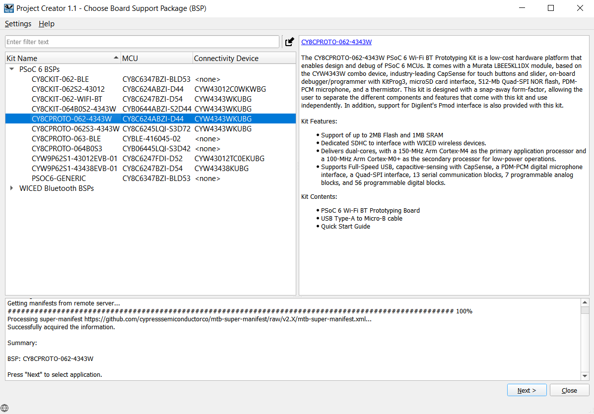
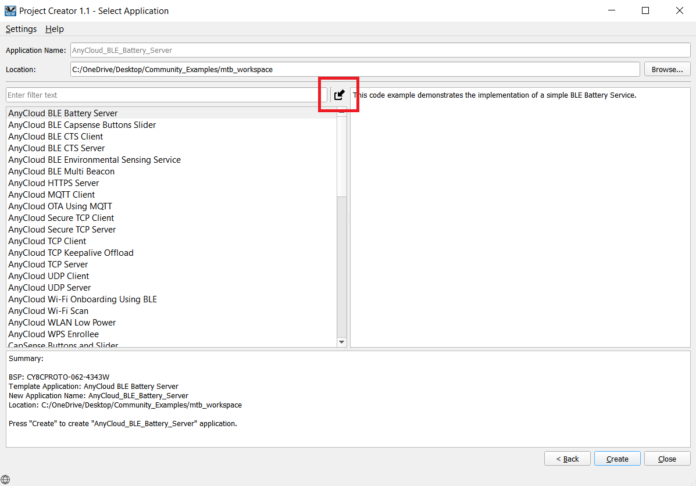
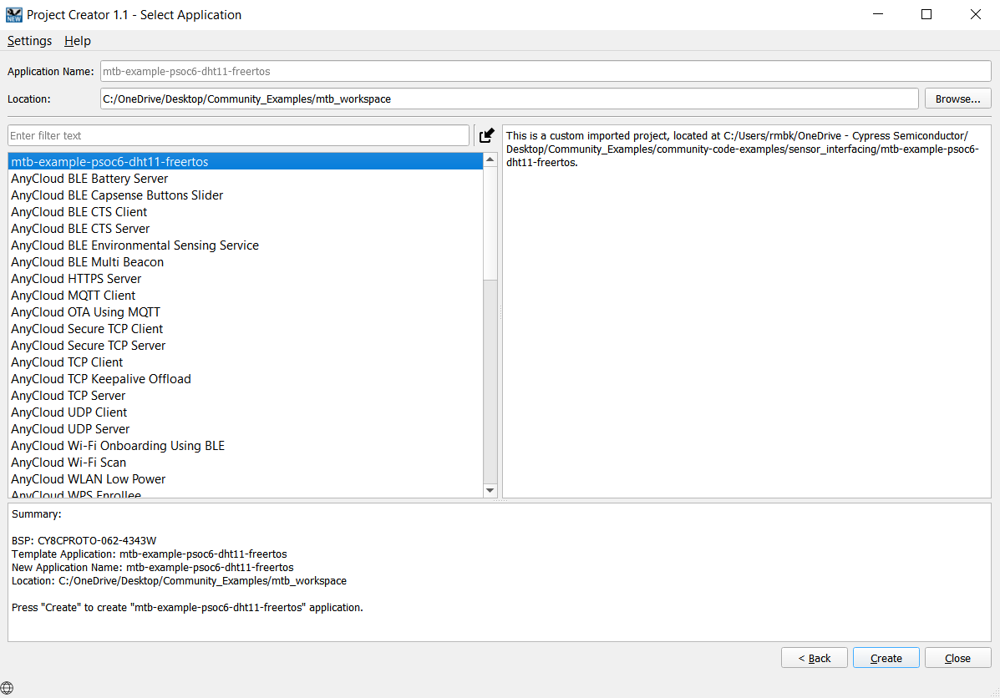

# Importing the exercises:
Here are the steps to import the projects into Eclipse IDE workspace

1. Clone the projects using the command:
  ```
  git clone https://github.com/cypresssemiconductorco/Community-Code-Examples.git
  ```

2. You will find all the exercises in the path community-code-examples/sensor_interfacing/mtb-example-psoc6-dht11-freertos/

3. Open ModusToolbox and create a workspace folder of choice.

4. Once the Eclipse IDE is open, click New Application > Choose BSP.



5. Click the Import symbol as shown below:



6. Point to the directory of the example containing the Makefile. Once selected you should see the name of the exercise visible under Application Name as shown below:



7. Click Create and then Close.

### Importing using CLI:

1. Download and unzip this repository onto your local machine, or clone the repository.

2. Open a CLI terminal and navigate to the application folder. 
   
   On Linux and macOS, you can use any terminal application. On Windows, navigate to the modus-shell directory (*{ModusToolbox install directory}/tools_\<version>/modus-shell*) and run *Cygwin.bat*.

3. Import required libraries by executing the `make getlibs` command.

## Running the exercises:

1. Open the Library Manager to choose the Active BSP and then click Apply.

2. Clean your application (mandatory step)

3. Build your application.

4. Program the device.

### Using CLI:

From the terminal, execute the `make program` command to build and program the application using the default toolchain to the default target. You can specify a target and toolchain manually:

  ```
  make program TARGET=<BSP> TOOLCHAIN=<toolchain>
  ```
  
  Example: 
  ```
  make program TARGET=CY8CPROTO-062-4343W TOOLCHAIN=GCC_ARM
  ```

  **Note:**  
  * Before building the application, ensure that the *deps* folder contains the BSP file (*TARGET_xxx.lib*) corresponding to the TARGET. 
  * If your TARGET BSP file does not exist in the *deps* folder, run `make modlibs` to open the Library Manager and add your target BSP.
  * Execute the `make getlibs` command to fetch the BSP contents before building the application.  


After programming, the application starts automatically. 
