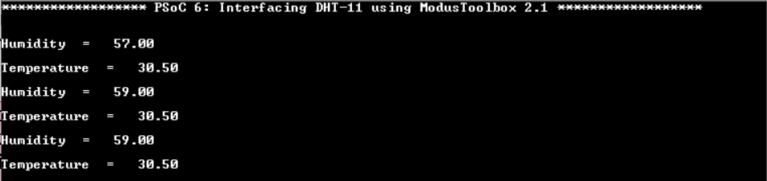

# Interfacing DHT-11 with PSoC 6 using ModusToolBox 2.1

This example demonstrates how to interface DHT 11 temperature and humidity sensor with PSoC 6 using Eclipse IDE for ModusToolbox™. 
The working of this example is explained in detail in this blog post - [Interfacing DHT-11 with PSoC 6 using ModusToolBox 2.1](https://community.cypress.com/community/software-forums/modustoolbox/blog/2020/07/31/interfacing-dht-11-with-psoc-6-using-modustoolbox-21)

## Hardware Setup

This example uses the board's default configuration. See the kit user guide to ensure that the board is configured correctly.

**Note**: The PSoC 6 BLE Pioneer Kit (CY8CKIT-062-BLE) and the PSoC 6 WiFi-BT Pioneer Kit (CY8CKIT-062-WIFI-BT) ship with KitProg2 installed. ModusToolbox software requires KitProg3. Before using this code example, make sure that the board is upgraded to KitProg3. The tool and instructions are available in the [Firmware Loader](https://github.com/cypresssemiconductorco/Firmware-loader) GitHub repository. If you do not upgrade, you will see an error like "unable to find CMSIS-DAP device" or "KitProg firmware is out of date".

Use jumper wires to establish a connection between the DHT 11 sensor and the PSoC 6 device as mentioned below.

1. Connect VCC of sensor to 3V3 supply on the Kit.

2. Connect GND of sensor to GND of the Kit.

3. Connect DATA pin of sensor to P6[3].

## Software Setup

Install a terminal emulator if you don't have one. Instructions in this document use [Tera Term](https://ttssh2.osdn.jp/index.html.en).

## Importing the example application

Please refer to [IMPORT.md](IMPORT.md) for importing the application

## Expected Result

1. The LED on the Kit toggles each time a valid data is read from the sensor.
2. The data read from the sensor is displayed on the UART terminal as shown in Figure 1

**Figure 1. UART Terminal displaying the sensor data**

